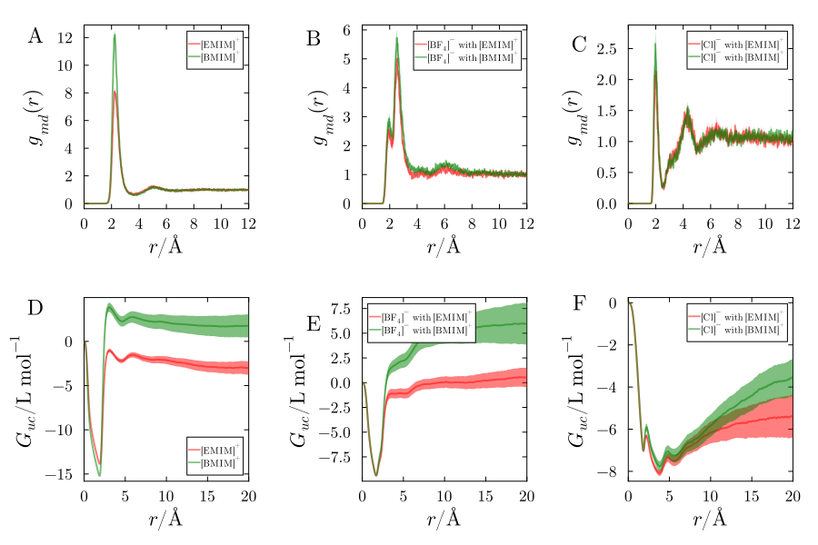
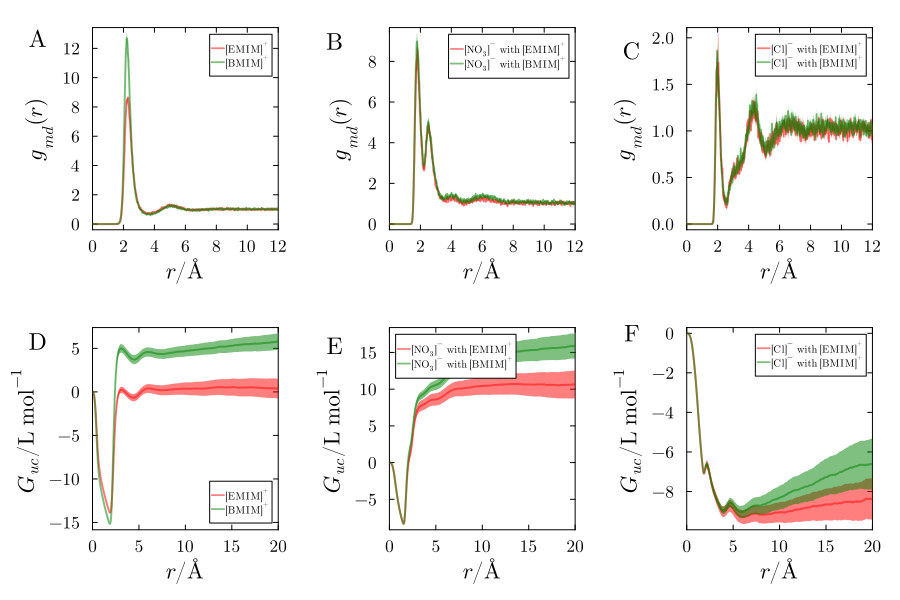
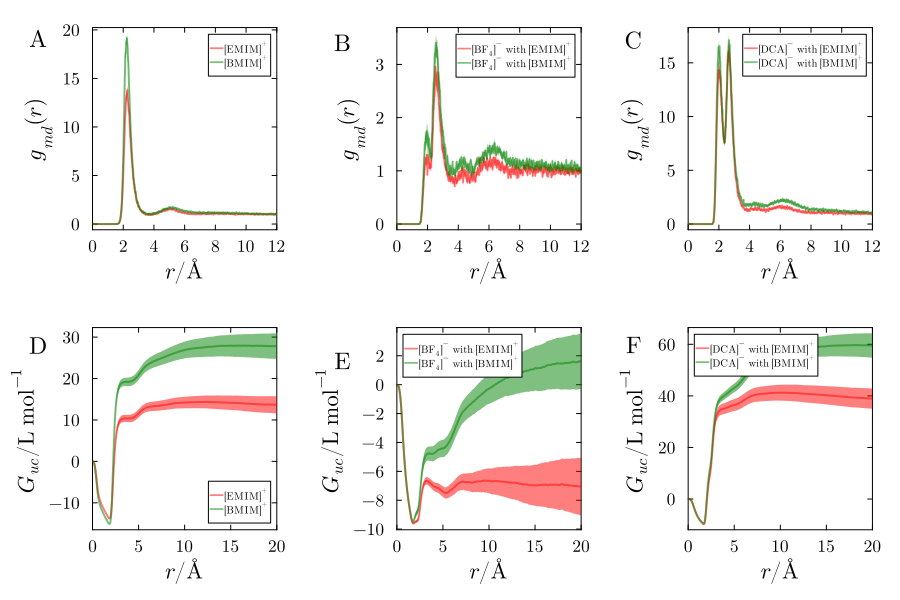
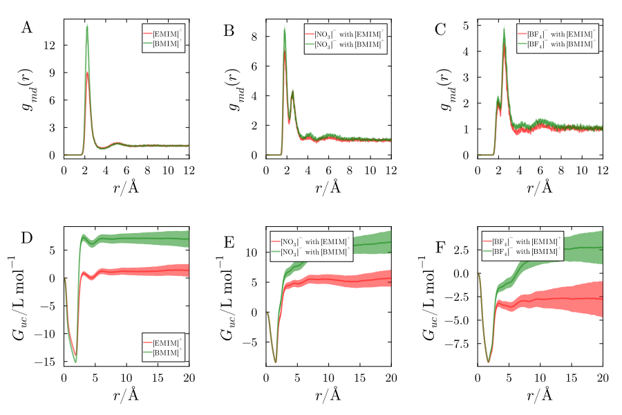

# Supporting Information for: Role of Imidazolium Cation Hydrophobicity in Ubiquitin Solvation by Aqueous Ionic Liquids

### Authors
- **Vinicius Piccoli**¹
- **Leandro Martínez**¹,*

¹Institute of Chemistry and Center for Computing in Engineering & Science, Universidade Estadual de Campinas (UNICAMP), 13083-861 Campinas, SP, Brazil

### Corresponding Author
*Leandro Martínez: lmartine@unicamp.br*  
Institute of Chemistry, Universidade Estadual de Campinas (UNICAMP).  
13083-970, Campinas, SP. Brazil  
[Group Website](http://m3g.iqm.unicamp.br)

---

### Description
This repository contains supporting information and code for the paper _"Role of Imidazolium Cation Hydrophobicity in Ubiquitin Solvation by Aqueous Ionic Liquids"_. The data includes simulations, plots, and tables used for comparison between ionic liquids containing [EMIM]+ and [BMIM]+ cations and their interactions with various anions. The supporting figures and data tables are available below.

---

## Minimum-distance distribution funtions and Kirkwood-Buff Integrals for other anions combinations

  

<figure style="text-align: center;">
  
  <figcaption style="text-align: justify;"> Figure S1 - Comparison of Minimum-Distance Distribution Functions (MDDFs) and Kirkwood-Buff (KB) integrals for ionic liquid systems containing [EMIM]+ and [BMIM]+ cations with various anions. Panels A and D compare the cations [EMIM]+ and [BMIM]+; panels B and E compare [BF4]- anions paired with [EMIM]+ and [BMIM]+; and panels C and F compare [Cl]- anions paired with [EMIM]+ and [BMIM]+. </figcaption>
</figure>

<figure style="text-align: center;">
  
  <figcaption style="text-align: justify;"> Figure S2 - Comparison of Minimum-Distance Distribution Functions (MDDFs) and Kirkwood-Buff (KB) integrals for ionic liquid systems containing [EMIM]+ and [BMIM]+ cations with various anions. Panels A and D compare the cations [EMIM]+ and [BMIM]+; panels B and E compare [NO3]- anions paired with [EMIM]+ and [BMIM]+; and panels C and F compare [Cl]- anions paired with [EMIM]+ and [BMIM]+. </figcaption>
</figure>

<figure style="text-align: center;">
  
  <figcaption style="text-align: justify;"> Figure S3. Comparison of Minimum-Distance Distribution Functions (MDDFs) and Kirkwood-Buff (KB) integrals for ionic liquid systems containing [EMIM]+ and [BMIM]+ cations with various anions. Panels A and D compare the cations [EMIM]+ and [BMIM]+; panels B and E compare [BF4]- anions paired with [EMIM]+ and [BMIM]+; and panels C and F compare [DCA]- anions paired with [EMIM]+ and [BMIM]+. </figcaption>
</figure>

<figure style="text-align: center;">
  
  <figcaption style="text-align: justify;"> Figure S4. Comparison of Minimum-Distance Distribution Functions (MDDFs) and Kirkwood-Buff (KB) integrals for ionic liquid systems containing [EMIM]+ and [BMIM]+ cations with various anions. Panels A and D compare the cations [EMIM]+ and [BMIM]+; panels B and E compare [NO3]- anions paired with [EMIM]+ and [BMIM]+; and panels C and F compare [DCA]- anions paired with [EMIM]+ and [BMIM]+. </figcaption>
</figure>

<figure style="text-align: center;">
  
  <figcaption style="text-align: justify;"> Figure S5. Comparison of Minimum-Distance Distribution Functions (MDDFs) and Kirkwood-Buff (KB) integrals for ionic liquid systems containing [EMIM]+ and [BMIM]+ cations with various anions. Panels A and D compare the cations [EMIM]+ and [BMIM]+; panels B and E compare [NO3]- anions paired with [EMIM]+ and [BMIM]+; and panels C and F compare [BF4]- anions paired with [EMIM]+ and [BMIM]+. </figcaption>
</figure>

## Preferential solvation parameters for all IL mixtures at 0.50 mol/L

<figure style="text-align: center;">
  
  <figcaption style="text-align: justify;"> Figure S6. Analysis of preferential solvation in all systems containing 0.5 mol L-1. The comparison is performed side by side by plotting the preferential solvation parameters of all anion mixtures paired with [EMIM]+ (red) and with [BMIM]+ (green). </figcaption>
</figure>

<figure style="text-align: center;">
  
  <figcaption style="text-align: justify;"> Figure S7. Kirkwood-Buff integrals for the cations in systems with [EMIM][Cl] + [EMIM][DCA] e [BMIM][Cl] + [BMIM][DCA]. The figure shows the KB integrals calculated considering 20 different simulations after 5 ns of NPT equilibration. Subfigures A), B), C), D), E) and F) represent EMIMDCA + EMIMBF4; D), E), and F) correspond to EMIMDCA + EMIMNO3; and G), H), and I) EMIMBF4 + EMIMNO3. </figcaption>
</figure>

<figure style="text-align: center;">
  
  <figcaption style="text-align: justify;"> Figure S8: Preferential solvation parameters for all ionic liquid mixtures at various concentrations. The plot illustrates that from 0.5 to 1.5 mol L⁻¹, the presence of [BMIM]⁺ results in greater IL accumulation around the protein. However, at higher concentrations (>1.5 mol L⁻¹), [EMIM]⁺ shows less preferential exclusion. As the concentration increases, the preferential solvation parameter generally becomes negative, indicating a shift in solvation dynamics. </figcaption>
</figure>

